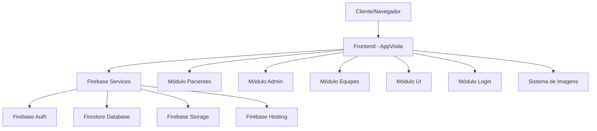
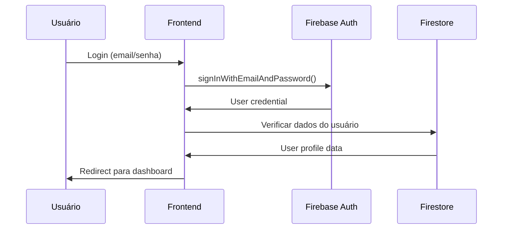
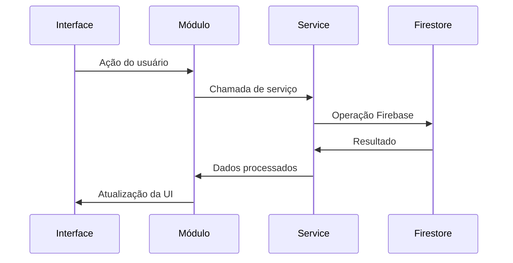
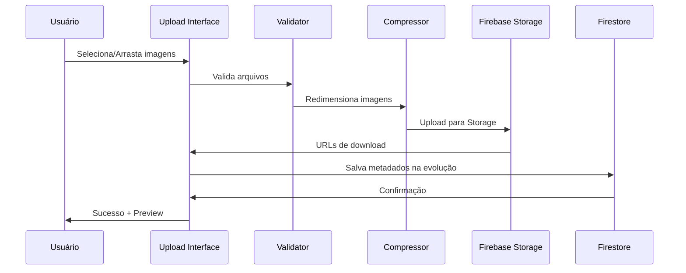

# 🏗️ Arquitetura do Sistema - AppVisita

## 📋 Índice
1. [Visão Geral da Arquitetura](#visão-geral-da-arquitetura)
2. [Camadas do Sistema](#camadas-do-sistema)
3. [Estrutura de Arquivos](#estrutura-de-arquivos)
4. [Fluxo de Dados](#fluxo-de-dados)
5. [Módulos e Componentes](#módulos-e-componentes)
6. [Sistema de Imagens Médicas](#sistema-de-imagens-médicas)
7. [Integrações Externas](#integrações-externas)
8. [Padrões Arquiteturais](#padrões-arquiteturais)

## 🎯 Visão Geral da Arquitetura

O AppVisita utiliza uma **arquitetura modular baseada em componentes** com frontend em JavaScript vanilla e backend via Firebase services. A aplicação segue o padrão **SPA (Single Page Application)** com roteamento pelo lado cliente.



## 🏗️ Camadas do Sistema

### 1. Camada de Apresentação (Frontend)
- **Tecnologia**: JavaScript ES6+, HTML5, CSS3
- **Responsabilidade**: Interface de usuário, validações client-side, roteamento
- **Componentes**: Módulos UI, Formulários, Dashboards

### 2. Camada de Lógica de Negócio (Business Logic)
- **Tecnologia**: JavaScript Modules
- **Responsabilidade**: Regras de negócio, validações, processamento de dados
- **Componentes**: AppModulos.*, validadores, utils

### 3. Camada de Serviços (Services)
- **Tecnologia**: Firebase SDK
- **Responsabilidade**: Comunicação com backend, cache, estado da aplicação
- **Componentes**: AppVisita.Firebase.*, serviços de autenticação

### 4. Camada de Dados (Data Layer)
- **Tecnologia**: Firebase Firestore
- **Responsabilidade**: Persistência, consultas, sincronização em tempo real
- **Componentes**: Collections, Documents, Indexes

## 📁 Estrutura de Arquivos

```
AppVisita/
├── index.html                 # Página principal (SPA)
├── style.css                  # Estilos globais
├── estilos-admin.css          # Estilos específicos do admin
│
├── script-otimizado.js        # Core Firebase + Configurações
├── app-modulos.js             # Módulos base e utilities
├── app-ui.js                  # Componentes de interface
│
├── app-login.js               # Módulo de autenticação
├── app-pacientes.js           # Módulo de gerenciamento de pacientes
├── app-diagnostico.js         # Módulo de diagnósticos
├── app-equipes.js             # Módulo de gerenciamento de equipes
├── app-admin.js               # Módulo administrativo
│
└── docs/                      # Documentação técnica
    ├── INSTALLATION.md
    ├── ARCHITECTURE.md
    └── ...
```

### Hierarquia de Dependências

```
index.html
├── Firebase SDKs (CDN)
├── script-otimizado.js        # Base + Firebase Config
├── app-modulos.js             # Utils + Base Modules
├── app-ui.js                  # UI Components
└── Feature Modules
    ├── app-login.js
    ├── app-pacientes.js
    ├── app-diagnostico.js
    ├── app-equipes.js
    └── app-admin.js
```

## 🔄 Fluxo de Dados

### 1. Inicialização da Aplicação

```javascript
1. Carregamento HTML/CSS
2. Firebase SDK Initialization
3. script-otimizado.js
   ├── Configuração Firebase
   ├── Verificação de autenticação
   └── Disparo evento 'firebase-ready'
4. app-modulos.js
   ├── Utilities básicos
   └── Estrutura de módulos
5. app-ui.js
   ├── Componentes de interface
   └── Sistema de notificações
6. Módulos específicos
   ├── Registro de event listeners
   └── Inicialização de funcionalidades
```

### 2. Fluxo de Autenticação



### 3. Fluxo de Operações CRUD



## 🧩 Módulos e Componentes

### 1. Módulo Core (script-otimizado.js)

```javascript
// Responsabilidades:
- Inicialização do Firebase
- Configuração de ambiente
- Verificação de autenticação
- Eventos globais
- Utilities básicos

// APIs Principais:
window.verificarFirebaseDisponivel()
window.AppVisita.Firebase.*
```

### 2. Módulo UI (app-ui.js)

```javascript
// Responsabilidades:
- Componentes reutilizáveis
- Sistema de modais
- Notificações
- Loading states
- Formatação de dados

// APIs Principais:
AppModulos.UI.mostrarModal()
AppModulos.UI.mostrarNotificacao()
AppModulos.UI.mostrarLoading()
```

### 3. Módulo Pacientes (app-pacientes.js)

```javascript
// Responsabilidades:
- CRUD de pacientes
- Gestão de evoluções
- Validações específicas
- Interface de busca

// APIs Principais:
AppModulos.Pacientes.salvar()
AppModulos.Pacientes.buscar()
AppModulos.Pacientes.adicionarEvolucao()
```

### 4. Módulo Admin (app-admin.js)

```javascript
// Responsabilidades:
- Gestão de usuários
- Aprovação de médicos
- Estatísticas do sistema
- Gestão de equipes

// APIs Principais:
AppModulos.Admin.carregarUsuarios()
AppModulos.Admin.carregarEstatisticas()
AppModulos.Admin.aprovarUsuario()
```

## 🔗 Integrações Externas

### Firebase Services

| Serviço | Utilização | Configuração |
|---------|------------|--------------|
| **Firebase Auth** | Autenticação de usuários | Email/senha, verificação |
| **Firestore** | Banco de dados NoSQL | Collections: usuarios, pacientes, equipes |
| **Firebase Storage** | Armazenamento de arquivos | Opcional, para armazenamento de imagens |
| **Firebase Hosting** | Deploy de produção | Opcional, para hosting estático |

### CDNs Externas

```html
<!-- Firebase SDKs -->
<script src="https://www.gstatic.com/firebasejs/9.17.1/firebase-app-compat.js"></script>
<script src="https://www.gstatic.com/firebasejs/9.17.1/firebase-auth-compat.js"></script>
<script src="https://www.gstatic.com/firebasejs/9.17.1/firebase-firestore-compat.js"></script>

<!-- Font Awesome (ícones) -->
<link rel="stylesheet" href="https://cdnjs.cloudflare.com/ajax/libs/font-awesome/6.0.0/css/all.min.css">
```

## 🎨 Padrões Arquiteturais

### 1. Module Pattern

```javascript
// Cada módulo segue o padrão:
const ModuloExemplo = {
  // Estado interno
  dados: {},
  
  // Métodos públicos
  inicializar() {},
  metodoPublico() {},
  
  // Métodos privados
  _metodoPrivado() {}
};

// Exportação global
window.AppModulos.Exemplo = ModuloExemplo;
```

### 2. Observer Pattern

```javascript
// Sistema de eventos para comunicação entre módulos
document.addEventListener('firebase-ready', () => {
  // Módulos reagem a eventos do sistema
});

document.dispatchEvent(new CustomEvent('evento-customizado', {
  detail: { dados: 'exemplo' }
}));
```

### 3. Singleton Pattern

```javascript
// Firebase e AppVisita são singletons globais
window.AppVisita = {
  Firebase: {
    Usuarios: UsuariosService,
    Pacientes: PacientesService,
    Equipes: EquipesService
  }
};
```

### 4. Factory Pattern

```javascript
// Criação de componentes UI dinâmicos
AppModulos.UI.criarModal = function(titulo, conteudo, opcoes) {
  // Factory para diferentes tipos de modal
};
```

## 🔄 Ciclo de Vida da Aplicação

### 1. Inicialização

```javascript
DOMContentLoaded → 
Firebase Init → 
firebase-ready event → 
Módulos Init → 
User Auth Check → 
Route to appropriate section
```

### 2. Navegação

```javascript
User Action → 
Hide all sections → 
Show target section → 
Load section data → 
Update UI
```

### 3. Operações de Dados

```javascript
User Input → 
Validation → 
Firebase Operation → 
Success/Error Handling → 
UI Update → 
Notification
```

## 📊 Métricas de Performance

### Tempo de Carregamento Esperado

- **First Paint**: < 1s
- **Firebase Ready**: < 2s
- **Interactive**: < 3s
- **Data Load**: < 2s

### Otimizações Implementadas

- **Lazy Loading**: Módulos carregam sob demanda
- **Event Delegation**: Reduz memory leaks
- **Debounced Search**: Evita requisições excessivas
- **Local Caching**: Estados mantidos em memória

## 🔒 Considerações de Segurança

### Frontend Security

- **XSS Prevention**: Sanitização de inputs
- **CSRF Protection**: Firebase tokens
- **Input Validation**: Client e server-side
- **Secure Storage**: localStorage apenas para dados não sensíveis

### Firebase Security

- **Authentication**: Obrigatória para todas as operações
- **Firestore Rules**: Acesso baseado em usuário autenticado
- **HTTPS Only**: Obrigatório em produção
- **Domain Whitelisting**: Apenas domínios autorizados

## 📸 Sistema de Imagens Médicas

### Arquitetura do Upload e Visualização


### Componentes do Sistema de Imagens

#### 1. Upload Component
```javascript
// Responsabilidades:
- Drag & Drop interface
- Validação de arquivos (tipo, tamanho)
- Preview das imagens
- Compressão automática
- Upload para Firebase Storage
- Barra de progresso

// APIs Principais:
window.uploadImagensParaStorage()
window.inicializarUploadImagens()
window.processarArquivosImagem()
```

#### 2. Image Viewer Component
```javascript
// Responsabilidades:
- Modal de visualização profissional
- Navegação entre múltiplas imagens
- Controles por teclado
- Interface responsiva
- Criação dinâmica via JavaScript

// APIs Principais:
window.abrirImagemModal()
window.renderizarGaleriaImagens()
window.inicializarModalImagem()
```

#### 3. Storage Organization
```
Firebase Storage Structure:
/evolucoes/
  /{pacienteId}/
    /{evolucaoId}/
      /{timestamp}_{index}_{filename}
```

### Fluxo de Upload de Imagens



### Especificações Técnicas

#### Validação de Arquivos
```javascript
const CONFIGURACAO_UPLOAD = {
  tiposPermitidos: ['image/jpeg', 'image/png', 'image/webp'],
  tamanhoMaximo: 5 * 1024 * 1024, // 5MB
  limiteQuantidade: 10,
  dimensoesMaximas: {
    width: 1200,
    height: 1200
  },
  qualidadeCompressao: 0.8
};
```

#### Estrutura de Metadados
```javascript
const metadadosImagem = {
  nomeOriginal: 'exame_resultado.jpg',
  tamanho: 1234567,
  tipo: 'image/jpeg',
  dataUpload: new Date(),
  url: 'https://storage.googleapis.com/...',
  dimensoes: { width: 800, height: 600 }
};
```

---

*Documentação técnica mantida pela equipe de desenvolvimento*
*Última atualização: 23 de Janeiro de 2025* 