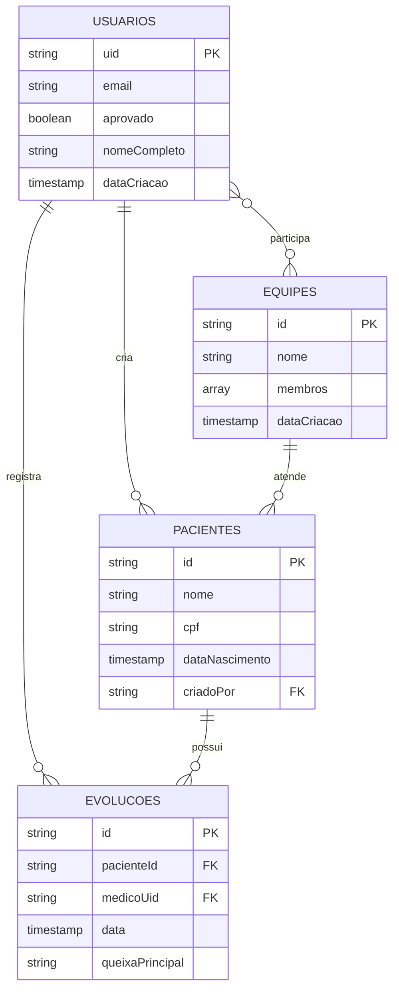

# 💾 Estrutura do Banco de Dados - AppVisita

## 📋 Índice
1. [Visão Geral](#visão-geral)
2. [Collections Principais](#collections-principais)
3. [Esquemas de Documentos](#esquemas-de-documentos)
4. [Relacionamentos](#relacionamentos)
5. [Índices e Performance](#índices-e-performance)
6. [Regras de Segurança](#regras-de-segurança)
7. [Migrations e Versionamento](#migrations-e-versionamento)

## 🎯 Visão Geral

O AppVisita utiliza **Firebase Firestore** como banco de dados NoSQL. A estrutura é organizada em collections principais que representam as entidades do sistema médico.

### Estrutura Geral

```
Firestore Database
├── usuarios/           # Médicos e administradores
├── pacientes/          # Pacientes do sistema
├── equipes/            # Equipes médicas
├── evolucoes/          # Evoluções médicas (subcollection de pacientes)
└── configuracoes/      # Configurações do sistema
```

## 📚 Collections Principais

### 1. Collection: `usuarios`

**Propósito**: Armazenar dados de médicos e administradores do sistema.

```javascript
{
  // Documento ID: Firebase Auth UID
  "email": "medico@exemplo.com",
  "aprovado": true,
  "dadosComplementaresPreenchidos": true,
  "dataCriacao": Timestamp,
  "ultimoLogin": Timestamp,
  
  // Dados complementares (opcionais)
  "nomeCompleto": "Dr. João da Silva",
  "cpf": "123.456.789-00",
  "telefone": "(11) 99999-9999",
  "especialidade": "Cardiologia",
  "crm": {
    "numero": "123456",
    "estado": "SP"
  },
  
  // Metadados
  "status": "aprovado", // "pendente" | "aprovado" | "bloqueado"
  "perfil": "medico",   // "medico" | "admin"
  "equipeIds": ["equipe1", "equipe2"] // IDs das equipes
}
```

### 2. Collection: `pacientes`

**Propósito**: Dados dos pacientes e subcollection de evoluções.

```javascript
{
  // Documento ID: Auto-gerado
  "nome": "Maria da Silva",
  "cpf": "987.654.321-00",
  "rg": "12.345.678-9",
  "dataNascimento": Timestamp,
  "endereco": {
    "rua": "Rua das Flores, 123",
    "cidade": "São Paulo",
    "estado": "SP",
    "cep": "01234-567"
  },
  "contato": {
    "telefone": "(11) 88888-8888",
    "email": "maria@exemplo.com"
  },
  "convenio": {
    "nome": "SulAmérica",
    "numero": "123456789",
    "validade": Timestamp
  },
  
  // Dados médicos básicos
  "alergias": ["Penicilina", "Látex"],
  "medicamentos": ["Losartan 50mg", "Sinvastatina 20mg"],
  "comorbidades": ["Hipertensão", "Diabetes tipo 2"],
  
  // Metadados
  "criadoPor": "uid_do_medico",
  "dataCriacao": Timestamp,
  "ultimaAtualizacao": Timestamp,
  "ativo": true,
  
  // Estatísticas (calculadas)
  "totalEvolucoes": 5,
  "ultimaEvolucao": Timestamp
}
```

### 3. SubCollection: `pacientes/{id}/evolucoes`

**Propósito**: Evoluções médicas de cada paciente.

```javascript
{
  // Documento ID: Auto-gerado
  "data": Timestamp,
  "medico": {
    "uid": "uid_do_medico",
    "nome": "Dr. João da Silva",
    "email": "joao@exemplo.com"
  },
  
  // Dados da evolução
  "queixaPrincipal": "Dor torácica há 2 dias",
  "historiaAtual": "Paciente refere dor precordial...",
  "exameFisico": "PA: 140x90mmHg, FC: 85bpm...",
  "avaliacaoPlano": "1. Investigar síndrome coronariana aguda...",
  
  // Sinais vitais
  "sinaisVitais": {
    "pressaoArterial": "140x90",
    "frequenciaCardiaca": 85,
    "temperatura": 36.5,
    "saturacaoO2": 98,
    "peso": 70.5,
    "altura": 165
  },
  
  // Prescrições
  "prescricoes": [
    {
      "medicamento": "AAS 100mg",
      "posologia": "1 comp 1x/dia",
      "orientacoes": "Tomar após o café"
    }
  ],
  
  // Exames solicitados
  "examesSolicitados": [
    "ECG",
    "Troponina",
    "CK-MB"
  ],
  
  // Metadados
  "criadaEm": Timestamp,
  "atualizadaEm": Timestamp,
  "equipeId": "id_da_equipe"
}
```

### 4. Collection: `equipes`

**Propósito**: Organização de equipes médicas.

```javascript
{
  // Documento ID: Auto-gerado
  "nome": "Equipe Cardiologia",
  "descricao": "Equipe especializada em cardiologia",
  "membros": [
    "uid_medico_1",
    "uid_medico_2",
    "uid_medico_3"
  ],
  
  // Configurações da equipe
  "ativa": true,
  "privada": false, // Se apenas membros podem ver pacientes
  
  // Estatísticas
  "totalMembros": 3,
  "totalPacientes": 25,
  "criadaPor": "uid_do_criador",
  
  // Metadados
  "dataCriacao": Timestamp,
  "ultimaAtualizacao": Timestamp,
  "excluido": false
}
```

### 5. Collection: `configuracoes`

**Propósito**: Configurações globais do sistema.

```javascript
{
  // Documento ID: "sistema"
  "versao": "1.0.0",
  "manutencao": false,
  "configuracoes": {
    "maxPacientesPorMedico": 100,
    "diasRetencaoDados": 365,
    "backupAutomatico": true
  },
  
  "notificacoes": {
    "emailAdmin": "admin@clinica.com",
    "alertas": true
  },
  
  "atualizadoEm": Timestamp,
  "atualizadoPor": "uid_admin"
}
```

## 🔗 Relacionamentos

### Relacionamentos Principais



### Queries Comuns

```javascript
// 1. Buscar pacientes de um médico
db.collection('pacientes')
  .where('criadoPor', '==', uid_medico)
  .orderBy('ultimaAtualizacao', 'desc')

// 2. Buscar evoluções recentes de um paciente
db.collection('pacientes').doc(pacienteId)
  .collection('evolucoes')
  .orderBy('data', 'desc')
  .limit(10)

// 3. Buscar usuários pendentes de aprovação
db.collection('usuarios')
  .where('aprovado', '==', false)
  .orderBy('dataCriacao', 'desc')

// 4. Buscar equipes de um médico
db.collection('equipes')
  .where('membros', 'array-contains', uid_medico)
  .where('ativa', '==', true)
```

## 📊 Índices e Performance

### Índices Recomendados

```javascript
// Collection: usuarios
{
  fields: ['aprovado', 'dataCriacao'],
  order: 'DESC'
}

// Collection: pacientes
{
  fields: ['criadoPor', 'ultimaAtualizacao'],
  order: 'DESC'
}
{
  fields: ['ativo', 'nome'],
  order: 'ASC'
}

// SubCollection: evolucoes
{
  fields: ['data'],
  order: 'DESC'
}
{
  fields: ['medico.uid', 'data'],
  order: 'DESC'
}

// Collection: equipes
{
  fields: ['membros', 'ativa'],
  order: 'ASC'
}
```

### Estratégias de Performance

1. **Paginação**: Usar `limit()` e `startAfter()` para grandes listas
2. **Cache Local**: Manter dados frequentes em memória
3. **Lazy Loading**: Carregar evoluções apenas quando necessário
4. **Denormalização**: Armazenar dados duplicados para evitar joins

### Exemplo de Paginação

```javascript
// Primeira página
let primeira = db.collection('pacientes')
  .orderBy('nome')
  .limit(25);

// Próxima página
let proximaPagina = db.collection('pacientes')
  .orderBy('nome')
  .startAfter(ultimoDocumento)
  .limit(25);
```

## 🔒 Regras de Segurança

### Regras Atuais do Firestore

```javascript
rules_version = '2';
service cloud.firestore {
  match /databases/{database}/documents {
    
    // Usuários: apenas dados próprios ou admin
    match /usuarios/{uid} {
      allow read, write: if request.auth != null && 
        (request.auth.uid == uid || isAdmin());
    }
    
    // Pacientes: apenas médicos autenticados
    match /pacientes/{pacienteId} {
      allow read, write: if request.auth != null && 
        isApprovedUser();
        
      // Evoluções: apenas médicos autenticados
      match /evolucoes/{evolucaoId} {
        allow read, write: if request.auth != null && 
          isApprovedUser();
      }
    }
    
    // Equipes: apenas membros ou admin
    match /equipes/{equipeId} {
      allow read: if request.auth != null && 
        (isTeamMember(equipeId) || isAdmin());
      allow write: if request.auth != null && isAdmin();
    }
    
    // Configurações: apenas admin
    match /configuracoes/{doc} {
      allow read: if request.auth != null;
      allow write: if request.auth != null && isAdmin();
    }
    
    // Funções auxiliares
    function isAdmin() {
      return request.auth.token.email == 'admin@email.com';
    }
    
    function isApprovedUser() {
      return exists(/databases/$(database)/documents/usuarios/$(request.auth.uid)) &&
        get(/databases/$(database)/documents/usuarios/$(request.auth.uid)).data.aprovado == true;
    }
    
    function isTeamMember(equipeId) {
      return request.auth.uid in 
        get(/databases/$(database)/documents/equipes/$(equipeId)).data.membros;
    }
  }
}
```

## 🔄 Migrations e Versionamento

### Estratégia de Migrations

```javascript
// Exemplo de migration para adicionar campo
async function migratePacientes() {
  const batch = db.batch();
  const pacientes = await db.collection('pacientes').get();
  
  pacientes.forEach(doc => {
    if (!doc.data().hasOwnProperty('ativo')) {
      batch.update(doc.ref, { ativo: true });
    }
  });
  
  await batch.commit();
}
```

### Versionamento de Schema

```javascript
// Cada documento pode ter versão do schema
{
  "schemaVersion": "1.2.0",
  "migradoEm": Timestamp,
  // ... outros campos
}
```

### Backup e Restore

```bash
# Backup via Firebase CLI
firebase firestore:delete --recursive -y

# Export
gcloud firestore export gs://bucket-backup/backup-$(date +%Y%m%d)

# Import
gcloud firestore import gs://bucket-backup/backup-20250123
```

## 📈 Monitoramento

### Métricas Importantes

- **Reads/Writes por dia**
- **Latência média das queries**
- **Erro rate por collection**
- **Tamanho total do banco**
- **Usuários ativos**

### Alertas Recomendados

- Spike de reads (> 1000/min)
- Erro rate alto (> 5%)
- Latência alta (> 2s)
- Uso de quota (> 80%)

---

*Documentação de banco de dados mantida pela equipe de desenvolvimento*
*Última atualização: 23 de Janeiro de 2025* 