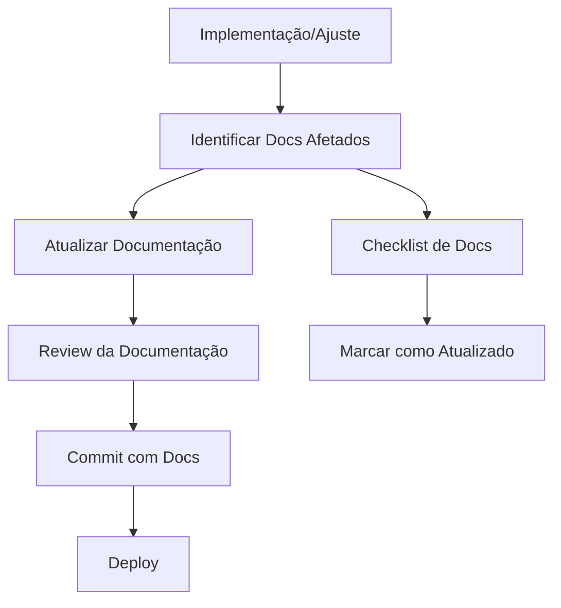

# 📝 Processo de Atualização da Documentação - AppVisita

## 🎯 Objetivo

**REGRA FUNDAMENTAL**: Toda nova implementação, ajuste ou correção DEVE ser acompanhada da atualização correspondente na documentação. Esta documentação é essencial para a comercialização e suporte do AppVisita.

## 🔄 Workflow Obrigatório

### Para Cada Mudança no Código



## ✅ Checklist de Atualização

### Antes de Qualquer Commit

- [ ] **Identifiquei** quais documentos são afetados pela mudança
- [ ] **Atualizei** a documentação técnica correspondente
- [ ] **Verifiquei** se o manual do usuário precisa de ajustes
- [ ] **Testei** os exemplos de código na documentação
- [ ] **Atualizei** a data de "última atualização"
- [ ] **Incrementei** a versão se necessário

### Documentos por Tipo de Mudança

| Tipo de Mudança | Documentos a Atualizar |
|------------------|------------------------|
| **Nova Funcionalidade** | ARCHITECTURE.md, USER_MANUAL.md, API.md |
| **Mudança de Interface** | USER_MANUAL.md, SCREENSHOTS |
| **Mudança no Banco** | DATABASE.md, MIGRATION_GUIDE.md |
| **Configuração** | INSTALLATION.md, DEPLOYMENT.md |
| **Bug Fix** | TROUBLESHOOTING.md, KNOWN_ISSUES.md |
| **Performance** | MONITORING.md, ARCHITECTURE.md |
| **Segurança** | SECURITY.md, INSTALLATION.md |

## 📋 Processo Detalhado

### 1. Análise de Impacto

```javascript
// Template de análise
const impactoDocumentacao = {
  mudanca: "Descrição da mudança implementada",
  arquivos_codigo: ["app-admin.js", "style.css"],
  documentos_afetados: [
    "docs/ARCHITECTURE.md - Seção X",
    "docs/USER_MANUAL.md - Capítulo Y",
    "README.md - Status do projeto"
  ],
  tipo_mudanca: "funcionalidade|bugfix|performance|security",
  urgencia: "alta|media|baixa"
};
```

### 2. Atualização Sistemática

#### A. Documentação Técnica
```bash
# 1. ARCHITECTURE.md
- Atualizar diagramas se necessário
- Incluir novos módulos/componentes
- Revisar fluxo de dados

# 2. DATABASE.md  
- Novos campos/collections
- Migrations necessárias
- Queries atualizadas

# 3. API.md
- Novos endpoints
- Mudanças em parâmetros
- Exemplos atualizados
```

#### B. Documentação de Usuário
```bash
# 1. USER_MANUAL.md
- Novas funcionalidades explicadas
- Screenshots atualizados
- Fluxos de trabalho revisados

# 2. FAQ.md
- Novas perguntas frequentes
- Soluções para problemas conhecidos

# 3. TROUBLESHOOTING.md
- Novos problemas identificados
- Soluções testadas
```

#### C. Documentação Operacional
```bash
# 1. MAINTENANCE.md
- Novos procedures
- Checklist atualizado
- Scripts modificados

# 2. MONITORING.md
- Novas métricas
- Alertas adicionais
- Dashboards atualizados
```

### 3. Template de Commit

```bash
# Exemplo de commit bem documentado
feat: Implementar estatísticas reais no dashboard admin

- Adicionada função carregarEstatisticasReais()
- Interface atualizada com dados do Firebase
- Usuários pendentes exibidos no dashboard

Docs Updated:
- ✅ ARCHITECTURE.md: Novo fluxo de estatísticas
- ✅ USER_MANUAL.md: Seção admin atualizada  
- ✅ DATABASE.md: Queries para estatísticas
- ✅ README.md: Status atualizado

Closes #123
```

## 🔍 Review de Documentação

### Critérios de Qualidade

#### ✅ Checklist de Review
- [ ] **Clareza**: Instruções são claras e objetivas
- [ ] **Completude**: Todas as informações necessárias estão presentes
- [ ] **Precisão**: Códigos e comandos estão corretos
- [ ] **Atualidade**: Datas e versões estão atualizadas
- [ ] **Consistência**: Formato e estilo mantidos
- [ ] **Testabilidade**: Exemplos podem ser reproduzidos

### Responsabilidades

| Papel | Responsabilidade |
|-------|------------------|
| **Desenvolvedor** | Atualizar docs técnicos |
| **Tech Lead** | Review e aprovação |
| **Product Owner** | Review de docs de usuário |
| **DevOps** | Review de docs operacionais |

## 📊 Métricas de Documentação

### KPIs Mensais

```javascript
const metricasDoc = {
  // Cobertura
  'funcionalidades_documentadas': '100%',
  'docs_atualizados_no_sprint': '95%',
  
  // Qualidade  
  'feedback_positivo_usuarios': '>90%',
  'tickets_por_falta_de_doc': '<5/mês',
  
  // Manutenção
  'docs_desatualizados': '<1 semana',
  'links_quebrados': '0'
};
```

### Auditoria Trimestral

#### Checklist de Auditoria
- [ ] Todos os módulos têm documentação
- [ ] Exemplos de código funcionam
- [ ] Screenshots estão atualizados
- [ ] Links internos funcionam
- [ ] Informações de contato estão corretas
- [ ] Versões estão sincronizadas

## 🚨 Alertas e Escalation

### Quando Escalar

| Situação | Ação | Responsável |
|----------|------|-------------|
| **Doc não atualizada por >3 dias** | Alerta para dev | Bot/Sistema |
| **Doc não atualizada por >1 semana** | Escalation para Tech Lead | Processo |
| **Release sem doc atualizada** | BLOQUEAR deploy | CI/CD |

### Automação

```bash
# Script de verificação (CI/CD)
#!/bin/bash
# check-docs.sh

MODIFIED_FILES=$(git diff --name-only HEAD~1 HEAD)
DOCS_UPDATED=false

# Verificar se documentação foi atualizada
for file in $MODIFIED_FILES; do
    if [[ $file == docs/* ]] || [[ $file == README.md ]]; then
        DOCS_UPDATED=true
        break
    fi
done

# Se código mudou mas docs não
if [[ $DOCS_UPDATED == false ]] && [[ $MODIFIED_FILES == *.js* ]]; then
    echo "❌ ERRO: Código modificado mas documentação não atualizada"
    echo "📝 Por favor, atualize a documentação relevante"
    exit 1
fi

echo "✅ Documentação verificada"
```

## 📝 Templates Úteis

### Template de Nova Funcionalidade

```markdown
## [Nome da Funcionalidade]

### Descrição
Breve descrição do que a funcionalidade faz.

### Como Usar
1. Passo a passo detalhado
2. Com exemplos práticos
3. Screenshots se necessário

### Código de Exemplo
```javascript
// Exemplo funcional
AppModulos.NovaFuncionalidade.usar();
```

### Considerações
- Limitações conhecidas
- Casos especiais
- Troubleshooting específico

*Adicionado em: [data]*
*Documentado por: [nome]*
```

### Template de API

```markdown
### `funcaoNova(parametros)`

**Descrição**: O que a função faz

**Parâmetros**:
- `param1` (string): Descrição do parâmetro
- `param2` (object, opcional): Descrição do parâmetro

**Retorna**: Tipo e descrição do retorno

**Exemplo**:
```javascript
const resultado = AppVisita.funcaoNova('valor', { opcao: true });
console.log(resultado); // { sucesso: true }
```

**Erros Comuns**:
- `ERRO_X`: Quando acontece e como resolver
```

## 🎯 Metas de Documentação

### Objetivos 2025

- [ ] **100% de cobertura** de funcionalidades
- [ ] **Zero docs desatualizadas** por >1 semana  
- [ ] **90% satisfação** de usuários com docs
- [ ] **Automação completa** de verificação
- [ ] **Docs multiidioma** (PT/EN)

### Roadmap

| Trimestre | Meta |
|-----------|------|
| **Q1 2025** | Documentação base completa |
| **Q2 2025** | Automação e CI/CD |
| **Q3 2025** | Docs avançados e tutoriais |
| **Q4 2025** | Internacionalização |

---

## ⚠️ LEMBRETE IMPORTANTE

> **A documentação é um PRODUTO, não um subproduto.**
> 
> Para o sucesso comercial do AppVisita, a documentação deve ser tratada com a mesma importância que o código. Uma funcionalidade só está completa quando está devidamente documentada.

**🔥 REGRA DE OURO**: Se não está documentado, não existe para o cliente.

---

*Processo de documentação - Versão 1.0.0*
*Criado em: 23 de Janeiro de 2025*
*Deve ser seguido por toda a equipe de desenvolvimento* 